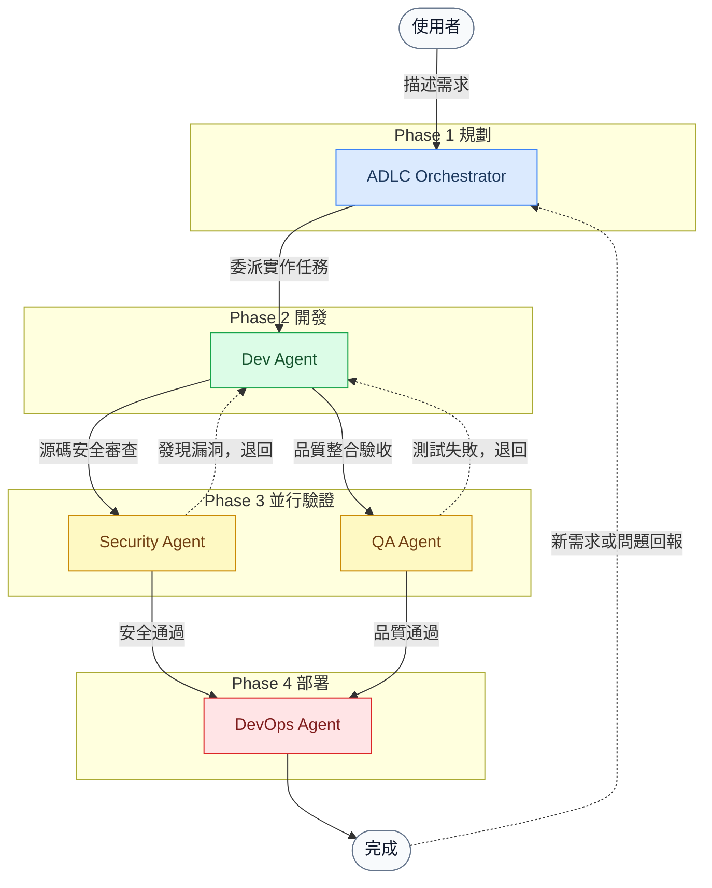

# ADLC (Agentic Development Lifecycle) 概覽

本文件說明專案中各個 AI Agent 之間的職責分配、交接規則以及自動化回饋循環邏輯。本專案採用 **GitHub Copilot Custom Agent Modes**，透過 `.github/agents/` 中的 Agent 指令檔定義各角色行為。

> 📋 **維護規範**：本文件與 `.github/agents/adlc.agent.md` 必須保持同步。修改任一方時須同步更新另一方。

## 1. 代理人關係圖 (Orchestration Map)

這張圖展示了 Agent 在開發生命週期中的縱向流轉、核心交付物以及回饋機制。

> [!TIP]
> **如何閱讀此圖**：
> - **實線箭頭**：核心交付流程（從需求到部署）。
> - **虛線箭頭**：回饋循環（發現問題退回修復，或外部新需求重新觸發流程）。

---

## 2. 角色職責說明 (Agent Roles)

| 角色 (Agent) | 工具模式 | 產出物 (Artifacts) | 核心目標 (Key Objective) |
| :--- | :--- | :--- | :--- |
| **ADLC Orchestrator** | `@adlc` | 任務分解計畫、協調結果摘要 | 銜接用戶需求與四個技術 Agent，主導整個開發生命週期流程。 |
| **Dev** | `@dev` | 原始碼 / 單元測試 | 嚴格遵循任務規格實作邏輯，確保本地編譯與測試通過。 |
| **Security** | `@security` | `docs/security-audit.md` | 進行源碼安全掃描（OWASP Top 10），阻斷含漏洞的代碼進入部署。 |
| **QA** | `@qa` | `docs/qa-report.md` | 並行審查，驗證代碼符合驗收標準，產出整合測試與 E2E 評估。 |
| **DevOps** | `@devops` | `Dockerfile` / CI/CD YAML | 自動化建置部署，維護 CI/CD 流水線，嚴格把關 Git 操作。 |

---

## 3. 核心循環邏輯 (Feedback Loops)

本專案將協作劃分為兩種維度的回饋迴圈：

### 1. 內部循環 (The Inner Loop) - *發生在 Validation 階段*

透過**並行分派 (Parallel Dispatch)** 同時啟動 **Security** 與 **QA**。一旦發現問題，審查結果會彙整後統一退回給 **Dev** 進行修復。此循環持續進行，直到 Security 與 QA 同時核准，才允許進入 Phase 4 部署流程。

### 2. 外部循環 (The Outer Loop) - *由用戶觸發*

當用戶提出新需求或回報問題時，重新呼叫 `@adlc`，即可觸發新一輪的四階段流程。ADLC Orchestrator 負責分析需求差異，決定從哪個 Phase 重新介入。

---

## 4. 如何啟動？

在 VS Code Copilot Chat 視窗中，切換至對應的 **Agent Mode** 即可啟動：

- **`@adlc`** — 啟動完整的四階段 ADLC 流程（**推薦入口點**）
- **`@dev`** — 直接委派開發工程師執行實作任務
- **`@qa`** — 直接啟動測試工程師進行品質驗收
- **`@security`** — 直接啟動安全官進行源碼安全審查
- **`@devops`** — 直接啟動維運工程師更新 CI/CD 流水線

> 💡 **建議工作流程**：以 `@adlc` 描述您的功能需求，由 Orchestrator 自動委派後續工作給各專責 Agent。
