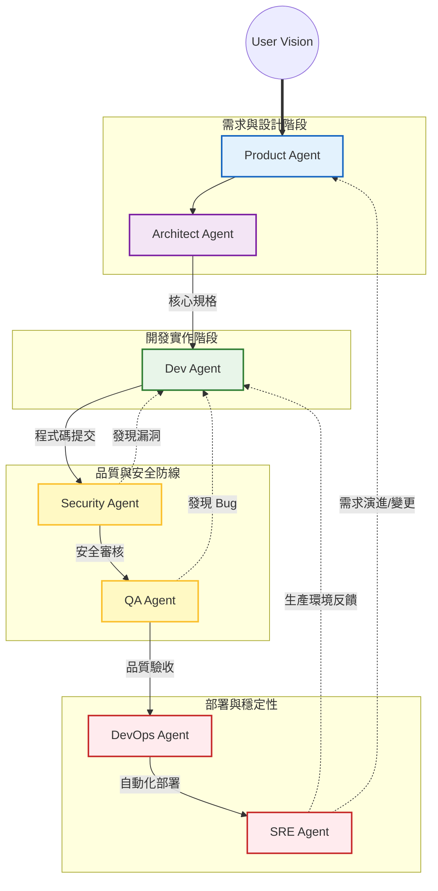

# ADLC (Agentic Development Lifecycle) 概覽

本文件說明專案中各個 AI Agent 之間的職責分配、交接規則以及自動化回饋循環邏輯。

## 1. 代理人關係圖 (Orchestration Map)

這張圖展示了 Agent 在開發生命週期中的縱向流轉、核心交付物以及回饋機制。

> [!TIP]
> **如何閱讀此圖**：
> - **實線箭頭**：核心交付流程（從需求到部署）。
> - **紅色虛線**：內部快速回饋循環（發生 Bug 或安全漏洞時自動退回）。
> - **藍色虛線**：外部長期閉環（根據生產環境數據優化或需求變更回饋到產品端）。

---

## 2. 角色職責說明 (Agent Roles)

| 角色 (Agent) | 產出物 (Artifacts) | 核心目標 (Key Objective) |
| :--- | :--- | :--- |
| **Product** | `docs/prd.md` | 定義「做什麼」與驗收標準 (AC)。 |
| **Architect** | `docs/architecture-design.md` | 定義「怎麼做」的結構與技術選型。 |
| **Dev** | 原始碼 / 單元測試 | 實作邏輯並確保本地編譯通過。 |
| **Security** | `docs/security-audit.md` | 安全性左移，阻斷含漏洞的代碼。 |
| **QA** | 整合測試報告 | 驗證代碼是否符合 PM 定義的 AC。 |
| **DevOps** | `Dockerfile` / CI-CD YAML | 自動化建置、測試與打包部署。 |
| **SRE** | `docs/rca-report.md` | 監控線上穩定性，主動發現運行異常。 |

---

## 3. 核心循環邏輯 (Feedback Loops)

### 內部循環 (The Inner Loop)
當 **Security** 或 **QA** 偵測到問題時，流程會自動「阻斷」並退回給 **Dev**。這是為了確保沒有瑕疵的程式碼進入部署階段。

### 外部循環 (The Outer Loop)
當 **SRE** 在生產環境偵測到異常，或 **User** 提出新需求時，流程會退回至 **Dev** (修正) 或 **Product** (重新定義)，形成持續進化的閉環。

---

## 4. 如何啟動？
您可以直接呼叫 `/pm-orchestrator` 來讓 Orchestrator Agent 引導您完成整個開發生命週期的管理。
