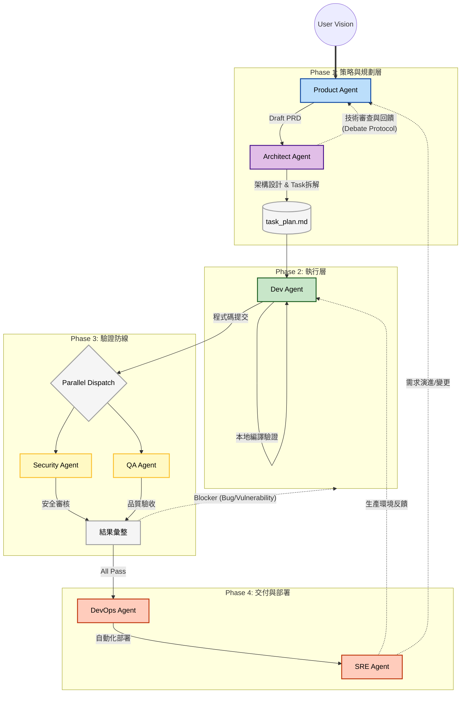

# ADLC (Agentic Development Lifecycle) 概覽

本文件說明專案中各個 AI Agent 之間的職責分配、交接規則以及自動化回饋循環邏輯。本專案採用**階層式多代理人架構 (Hierarchical Multi-Agent Architecture)**，透過實體檔案進行上下文隔離與任務交接。

## 1. 代理人關係圖 (Orchestration Map)

這張圖展示了 Agent 在開發生命週期中的縱向流轉、核心交付物以及回饋機制。

> [!TIP]
> **如何閱讀此圖**：
> - **實線箭頭**：核心交付流程（從需求到部署）。
> - **紅色虛線**：內部快速回饋循環（發生規劃衝突、Bug 或安全漏洞時自動退回）。
> - **藍色虛線**：外部長期閉環（根據生產環境數據優化或需求變更回饋到產品端）。

---

## 2. 角色職責說明 (Agent Roles)

| 角色 (Agent) | 產出物 (Artifacts) | 核心目標 (Key Objective) |
| :--- | :--- | :--- |
| **Product** | `docs/prd.md` | 定義「做什麼」與驗收標準 (AC)。 |
| **Architect** | `docs/architecture-design.md`, `.agents/task_plan.md` | 定義「怎麼做」的結構與技術選型，並**負責將規格拆解為 Dev Agent 可執行的原子化工作單 (Task Decomposition)**，強制包含文件同步任務。 |
| **Dev** | 原始碼 / 單元測試 | 嚴格遵循 Task Plan 實作邏輯並確保本地編譯通過。 |
| **Security** | `docs/security-audit.md` | 進行並行源碼掃描，安全性左移，阻斷含漏洞的代碼。 |
| **QA** | `docs/qa-report.md` | 並行審查，驗證代碼是否符合 PM 定義的 AC，產出整合測試評估。 |
| **DevOps** | `Dockerfile` / CI-CD YAML | 自動化建置部署，核對 README 等文件同步狀態，並嚴格把關 Git 操作的當前目錄 (CWD)。 |
| **SRE** | `docs/rca-report.md` | 監控線上穩定性，主動發現運行異常。 |

---

## 3. 核心循環邏輯 (Feedback Loops)

本專案將協作劃分為三種維度的回饋迴圈：

### 1. 協商循環 (Debate Protocol) - *發生在 Planning 階段*
**Product Agent** 與 **Architect Agent** 之間並非單向指示。當 PM 提出 PRD 初稿後，架構師會評估技術可行性。若架構師認為有風險或效能疑慮，流程會退回給 PM 修改 `prd.md`，直到雙方達成共識才進入開發。

### 2. 內部循環 (The Inner Loop) - *發生在 Validation 階段*
透過**並行分派 (Parallel Dispatch)** 同時啟動 **Security** 與 **QA**。一旦發現問題，審查結果會彙整統一退回給 **Dev** 進行修復。這是為了確保沒有瑕疵的程式碼進入部署階段。

### 3. 外部循環 (The Outer Loop) - *發生在營運維護階段*
當 **SRE** 在生產環境偵測到異常，或 **User** 提出新需求時，流程會退回至 **Dev** (修正) 或 **Product** (重新定義)，形成持續進化的閉環。

---

## 4. 如何啟動？
請在 Antigravity 視窗中呼叫 `/adlc-pipeline` 或 `/pm-orchestrator`，引導您完成整個階層式開發生命週期的管理。
