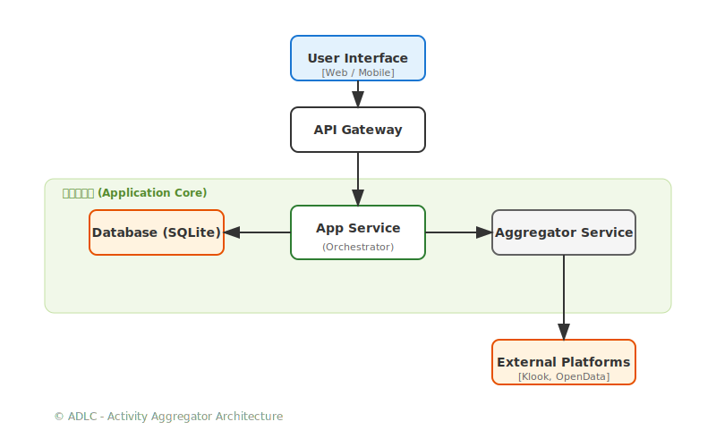
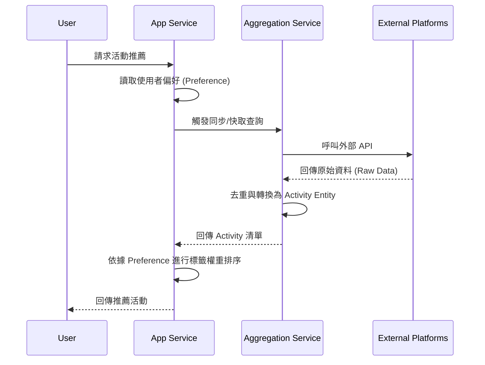

# 系統架構設計 - 萬能活動整理系統 (Activity Aggregator)

## 0. 視覺化架構概覽 (Visual Overview)

> [!NOTE]
> 以上架構圖採用向量格式 (SVG) 產出，確保文字精準且原生支援 VS Code 預覽與 GitHub 顯示。

## 1. 領域驅動設計 (DDD) 模型

### 核心實體與聚合根 (Entities & Aggregate Roots)
*   **User (使用者)** [Aggregate Root]: 系統使用者資訊。
*   **Preference (偏好設定)** [Value Object]: 使用者的篩選權重（標籤、預算、區域）。
*   **Activity (活動)** [Entity]: 跨平台統整後的標準化活動物件。使用 `sourcePlatform` + `externalId` 作為動態去重識別。

## 2. 系統架構分層 (System Layering)
如上圖所示，系統分為四個核心層次：
1.  **UI 展現層**：負責使用者互動與偏好設定輸入。
2.  **應用服務層 (核心大腦)**：協調「資料彙整」與「偏好匹配」。
3.  **彙整/基礎設施層**：對接多個外部平台 (Klook, Open Data)，進行資料清理與標準化。
4.  **持久化層**：使用 SQLite 儲存已抓取的活動與用戶偏好，提升系統反應速度。

## 3. 資料處理流程 (Data Flow)

## 4. 技術選型建議
*   **Language**: TypeScript (強型別確保資料模型一致)。
*   **Persistence**: Prisma ORM + SQLite (輕量開發)。
*   **Crawling/Fetching**: `axios` + `cheerio` (用於無 API 的平台)。
