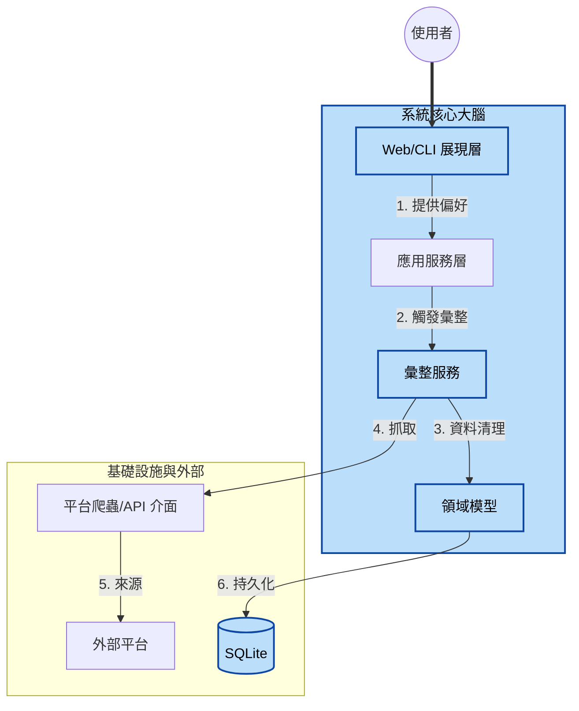
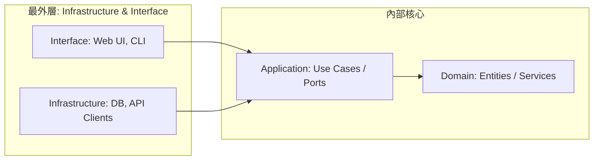
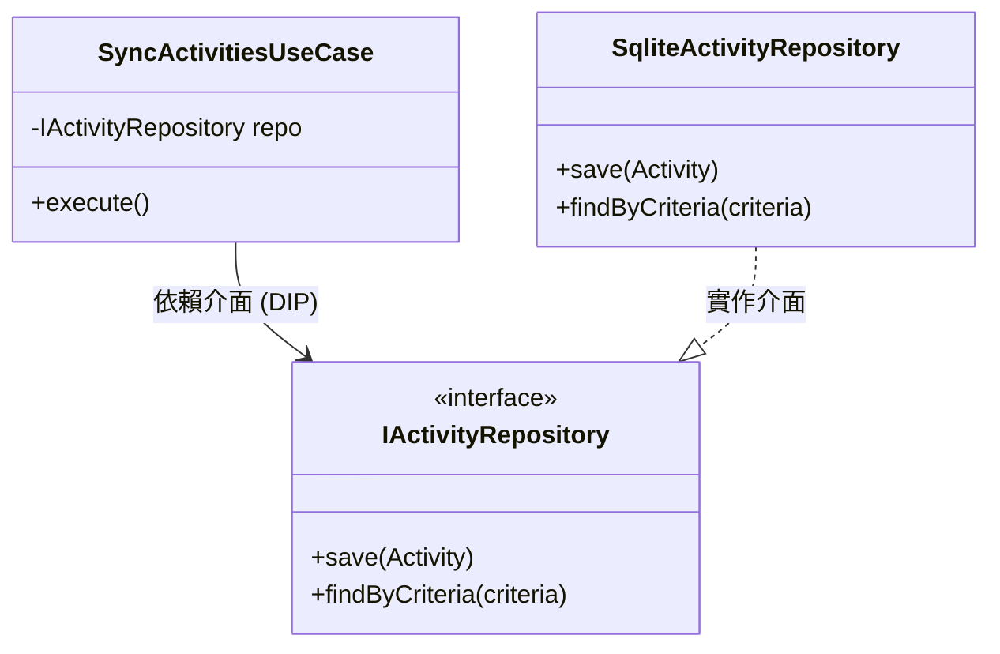
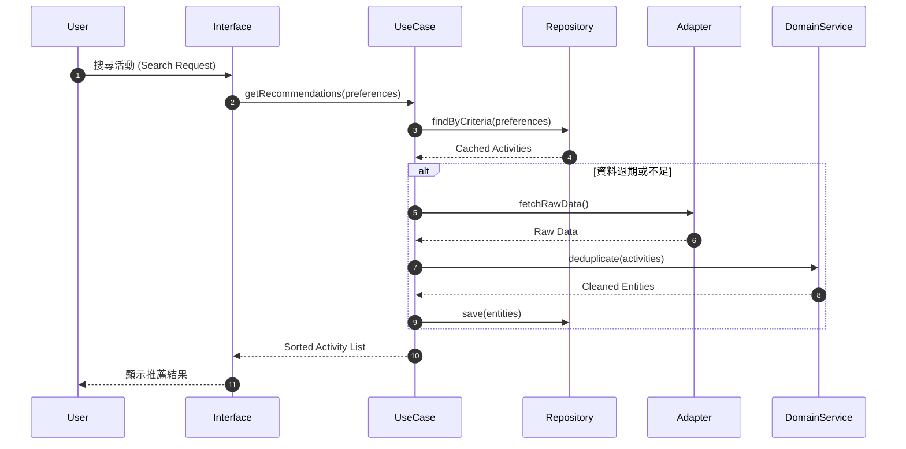

# 系統架構設計 - 萬能活動整理系統 (Activity Aggregator)

本文件定義系統的架構基礎、層次結構與領域映射關係，確保從業務需求到代碼實作具備完整的可追蹤性。

## 1. 系統願景與概覽 (System Context)

### 1.1 核心價值
整合多個分散的活動平台（如 Klook, KKday, 政府 Open Data），透過「去重邏輯」與「個人化偏好匹配」，提供使用者最精準的活動建議。

### 1.2 高階架構圖


---

## 2. 領域深潛 (Domain Deep Dive)

本系統的核心邏輯在於代碼中的「領域實體」。

### 2.1 實體與聚合根 (Entities)
| 實體名稱 | 職責 | 關鍵屬性 |
| :--- | :--- | :--- |
| **Activity** | 最小活動單元 | `sourcePlatform`, `externalId`, `tags`, `price` |
| **User** | 偏好儲存者 | `userId`, `preferences` |

### 2.2 去重邏輯 (Deduplication)
為防止同一活動在 Klook 與 KKday 同時出現時重複顯示，系統採用以下策略：
*   **標識生成**：`SHA256(normalize(Title) + Date + Location)`。
*   **衝突解決**：若標識相同，優先保留資訊更新鮮或詳細度更高的版本。

---

## 3. 模組實作與分層 (Module Realization)

本系統採用 **Onion Architecture (洋蔥架構)**，結合 **DDD 領域驅動設計**，強調「依賴永遠指向核心」的原則。這種結構能確保核心業務邏輯（Domain）不受外部技術變動（如資料庫遷移或 UI 框架更換）的影響。

### 3.1 四層架構定義

| 層級 (Layer) | 職責 (Responsibilities) | 內容物 (Examples) | 依賴關係 |
| :--- | :--- | :--- | :--- |
| **Domain** | 核心業務規則、狀態變更 | `Activity` (Entity), `DeduplicationService` | 無 |
| **Application** | 協調用例 (Use Cases)、流程控制 | `SyncActivitiesUseCase`, `RecommendationService` | → Domain |
| **Infrastructure** | 技術細節實現（Persistence, API） | `SqliteActivityRepository`, `KlookAdapter` | → Domain, Application |
| **Interface** | 使用者入口（CLI, REST API, UI） | `ActivityController`, `SearchCLI` | → Application |



> [!NOTE]
> 在洋蔥架構中，**Infrastructure** 與 **Interface** 同屬最外層。
> *   **Interface** 調用 Application 層的用例。
> *   **Infrastructure** 實作 Application/Domain 定義的抽象介面（如 Repository）。
> *   這確保了當資料庫或 UI 框架改變時，核心業務邏輯（Domain）完全不受影響。


### 3.2 目錄結構規範

為確保 ADLC 中的 **Dev Agent** 能精準定位代碼，專案採用以下目錄結構：

```text
src/
├── domain/                    # 領域層：純業務邏輯
│   ├── entities/              # 活動、使用者實體
│   ├── services/              # 跨實體的邏輯 (例：去重判斷)
│   └── repositories/          # [介面] 定義資料存取合約
├── application/               # 應用層：協調調度
│   ├── use-cases/             # 具體場景 (例：同步外部活動)
│   └── dtos/                  # 資料傳輸對象
├── infrastructure/            # 基礎設施層：硬體與第三方實現
│   ├── persistence/           # SQLite / Prisma 實作
│   ├── adapters/              # 爬蟲與外部 API 實作
│   └── config/                # 環境變數與配置
└── interface/                 # 接口層：與外界通訊
    ├── http/                  # Express/Next.js 路由
    └── cli/                   # 命令列工具介面
```

### 3.3 依賴倒置 (Dependency Inversion)

在洋蔥架構中，位於**最外層 (External)** 的 `Infrastructure` 不會被內層依賴，而是反過來依賴內層定義的抽象介面。
*   **範例**：`SyncActivitiesUseCase` (Application 層) 依賴於 `IActivityRepository` (Domain 層)，而位於最外層的 `SqliteActivityRepository` (Infrastructure 層) 則負責實作該介面。
*   **效益**：這確保了核心業務與外部技術實現（如資料庫）徹底解耦。



---

## 4. 追蹤矩陣 (Traceability Matrix)

明確標註業務需求如何落地至技術細節。

| 業務需求 | 領域邏輯 (Domain) | 技術實現 (Infra/DB) |
| :--- | :--- | :--- |
| **跨平台去重** | `Activity.generateUniqueId()` | `DB.Activities.uniqueIndex` |
| **個人化推薦** | `Preference.calculateWeight()` | `Prisma.findMany({orderBy...})` |
| **即時同步** | `AggregationService.sync()` | `Axios` + `Cheerio` (Crawlers) |

---

## 5. 核心流程序列 (Key Flow)

描述「活動推薦」的動態協作，展現各層級如何透過 DIP 進行互動。


