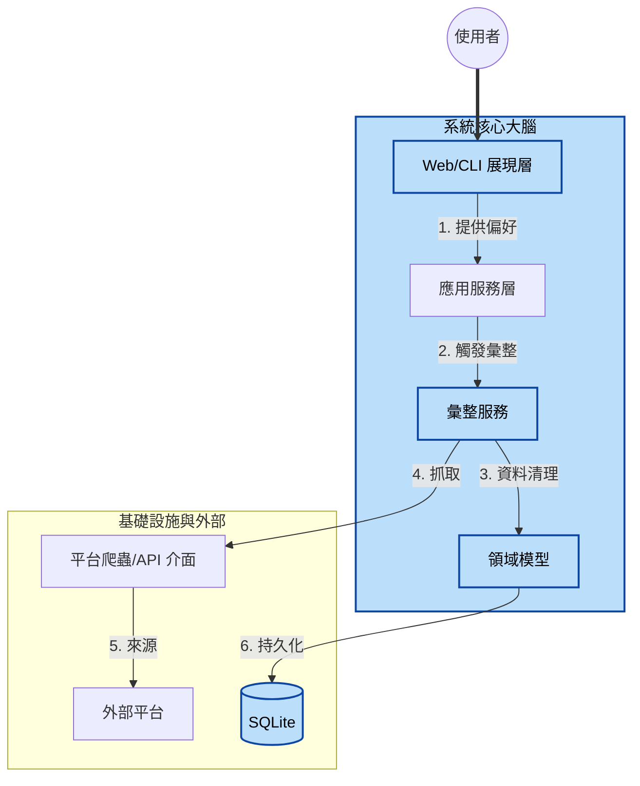
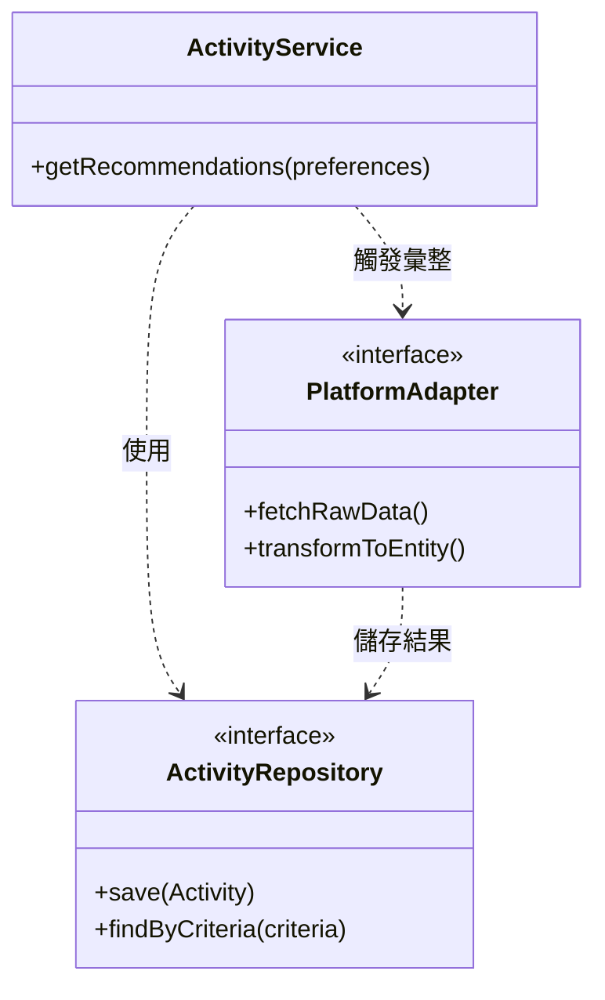
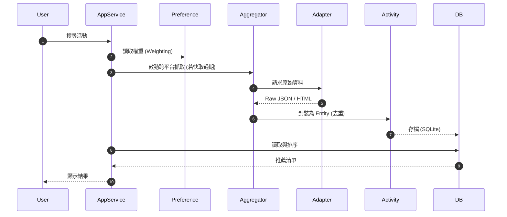

# 系統架構設計 - 萬能活動整理系統 (Activity Aggregator)

本文件定義系統的架構基礎、層次結構與領域映射關係，確保從業務需求到代碼實作具備完整的可追蹤性。

## 1. 系統願景與概覽 (System Context)

### 1.1 核心價值
整合多個分散的活動平台（如 Klook, KKday, 政府 Open Data），透過「去重邏輯」與「個人化偏好匹配」，提供使用者最精準的活動建議。

### 1.2 高階架構圖

---

## 2. 領域深潛 (Domain Deep Dive)

本系統的核心邏輯在於代碼中的「領域實體」。

### 2.1 實體與聚合根 (Entities)
| 實體名稱 | 職責 | 關鍵屬性 |
| :--- | :--- | :--- |
| **Activity** | 最小活動單元 | `sourcePlatform`, `externalId`, `tags`, `price` |
| **User** | 偏好儲存者 | `userId`, `preferences` |

### 2.2 去重邏輯 (Deduplication)
為防止同一活動在 Klook 與 KKday 同時出現時重複顯示，系統採用以下策略：
*   **標識生成**：`SHA256(normalize(Title) + Date + Location)`。
*   **衝突解決**：若標識相同，優先保留資訊更新鮮或詳細度更高的版本。

---

## 3. 模組實作與分層 (Module Realization)

採用 **Ports and Adapters (Hexagonal Architecture)** 架構。

---

## 4. 追蹤矩陣 (Traceability Matrix)

明確標註業務需求如何落地至技術細節。

| 業務需求 | 領域邏輯 (Domain) | 技術實現 (Infra/DB) |
| :--- | :--- | :--- |
| **跨平台去重** | `Activity.generateUniqueId()` | `DB.Activities.uniqueIndex` |
| **個人化推薦** | `Preference.calculateWeight()` | `Prisma.findMany({orderBy...})` |
| **即時同步** | `AggregationService.sync()` | `Axios` + `Cheerio` (Crawlers) |

---

## 5. 核心流程序列 (Key Flow)

描述「活動推薦」的動態協作。

